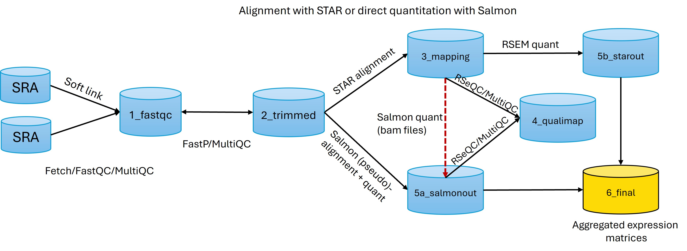

TODO: add details about the RNAseq preprocessing pipeline here

## The Bioinformatics RNAseq Data Fetch and Preprocessing Pipeline




### All the bash scripts used for pre-processing the RNA-seq data are available in this directory.
- In the exploratory directory, there are some additional scripts that were used for testing and exploring different tools and methods.

In the box below is a list of the main scripts used in the pipeline along with a brief description of their functionality. The scripts are hyperlinked. The numbers correspond to the order in which they can be executed in the pipeline.

| Script Name          | Description                                                  |
|----------------------------|--------------------------------------------------------------|
|1)[`fetch_script`](./scripts/fetch_script.sh) | Fetches SRA files from GEO/SRA database with GNU parallel for prefetching and fasterq-dump. In the `./sra` directory create a `GSEXXXXXXXXX` subdirectory and store the `SRR_Acc_List.txt` list of SRA run accessions. The script extracts the SRAs and converts them to FASTQ files, and subsequently they are compressed with pigz. |
|2)[`process_fastqc`](./scripts/process_fastqc)  | Performs quality control using FastQC and MultiQC on FASTQ files. The output is stored in `1_fastqc` and uses GNU for parallelization. | 
|3)[`trimm_fastp`](./scripts/trimm_fastp)   | Finds the soft-linked FASTQ files in `0_raw` and perform trimming using FastP. The output is trimmed FASTQ files in ``2_trimmed`` directory along with the HTML report. Uses GNU for parallelization. With **5 cores**, it takes around **1 min to filter ~60million** reads. The reads were filtered for polyG tails and trimmed based on quality in a sliding window of 4 starting from the `tail/3'end` with minimum score of phred=20. The script is set to **4 jobs** (20cores), and it takes ~80seconds for 4 pair-end samples. Then **FASTQC paralleled** is run for the new samples, followed by a multiQC. The FASTQC files are saved with a `_trimmed_1_fastq.gz` name tag in the `1_fastq` directory.|
|4)[`star_align`](./scripts/star_align) | Maps the trimmed FASTQ files using STAR aligner to the human genome (hg38). The output BAM files are stored in `3_mapping` directory. The STAR output are sorted genomic BAM files and transcriptome-SAM files. The former will be used for QC and the latter as input for RSEM quantification.|
|5)[`quant_salmon`](./scripts/quant_salmon) | Quantifies the expression using Salmon in quantitation mode from the trimmed FASTQ files in the `2_trimmed` directory. The output is a subdirectory per sample named from its SRR/basename in `5a_salmonout` directory. |
|6)[`post_alignqc`](./scripts/post_alignqc) | Performs QC on the aligned sorted BAM files using Qualimap and RSeQC tools. MultiQC is then run to aggregate both Salmon and STAR reports. The output is stored in `4_qualimap` directory. Uses GNU for parallelization. |
|7)[`quant_rsem`](./scripts/quant_rsem) | Quantifies the expression using RSEM from the STAR transcriptome-SAM files in `3_mapping` directory. The output is a subdirectory per sample named from its SRR/basename in `5b_starout` directory. Uses GNU for parallelization. |

```bash
awk -F '[[:space:]]*\\|[[:space:]]*' 'BEGIN { OFS = "\t"; print "method", "cores", "time" } {print $2, $3, $4}' ./scripts/exploratory/time.log | sed 's#seconds##g'
```